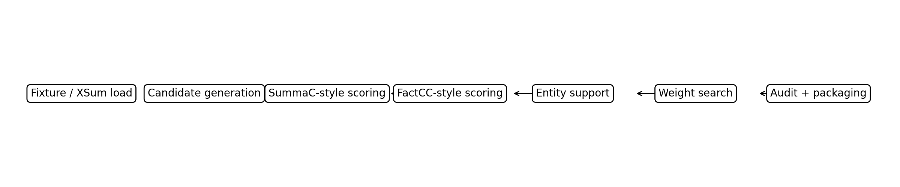
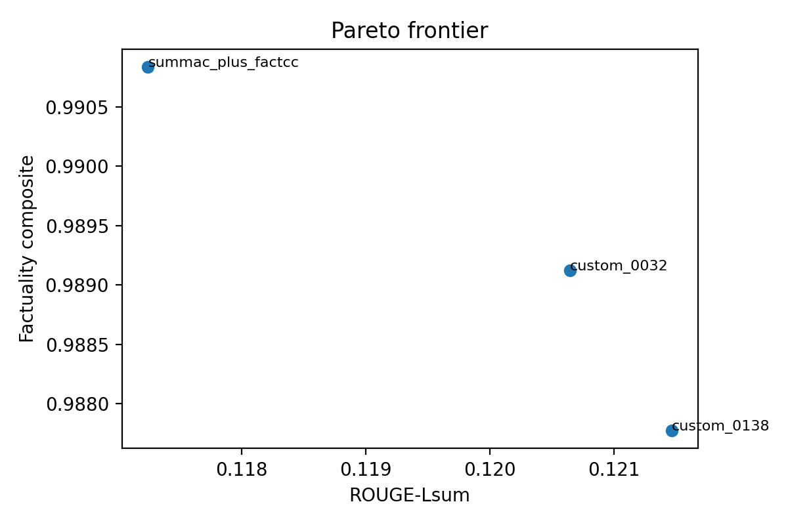
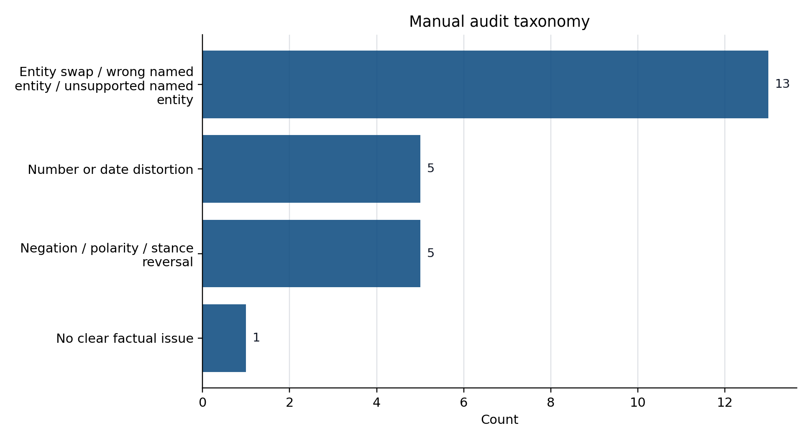

## Problem and Setup

- XSum rewards compression, so fluent hallucinations are common.
- Overlap metrics alone do not tell us whether a summary is supported by the article.
- Keep the public `facebook/bart-large-xsum` path as the baseline.
- Ask whether reranking can trade a small amount of ROUGE for better factuality.
- Headline trade-off: factuality composite `0.3324 -> 0.4420`, ROUGE-Lsum `0.3569 -> 0.3398`
- Bounded scope: `train=128`, `val_tune=64`, `val_full=128`, `test=128`, qualitative subset `=24`

{ width=60% }

## Method and Main Result

- Fine-tune `facebook/bart-large-xsum` on the bounded train split.
- Generate beam candidates with sizes `4`, `8`, and `16`.
- Rerank with likelihood, SummaC-style support, FactCC-style consistency, and entity support.
- Select the operating point on validation search, then evaluate once on the test split.
- Main result: factuality composite `0.3324 -> 0.4420`
- Main trade-off: ROUGE-Lsum `0.3569 -> 0.3398`
- Bootstrap result: factuality CI stays positive; ROUGE CI stays slightly negative

## Search and Refinement

{ width=54% }

- Selected operating point: `custom_0097`, beam `16`
- Factuality-heavy weights: `logprob=0.0`, `summac=0.75`, `factcc=1.0`, `entity=0.5`
- Refinement: add entity support after error analysis
- Ablation: `0.4061 -> 0.4106`

## Qualitative Analysis and Limits

{ width=38% }

- 24-example stratified qualitative analysis with `Codex / AI-assisted expert adjudication`
- Outcome counts: reranker win `8`, baseline win `8`, tie/close `8`
- Dominant remaining failure: entity distortion (`12/24`)
- This is a bounded study, not a benchmark-scale XSum claim

## Takeaways

- Simple reranking signals materially improve factuality on this bounded XSum run.
- Entity support is a useful small refinement, not a silver bullet.
- The strongest remaining gap is entity-level hallucination when all candidates drift the same way.
- The next strongest improvements would likely come from better candidate diversity, stronger entity constraints, and broader external evaluation.
